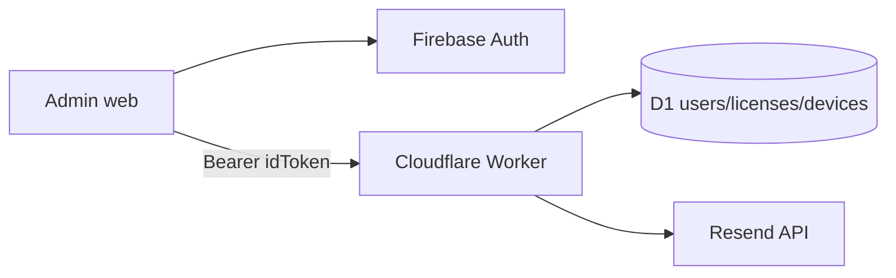

# Technical Design

## Overview

La solución amplía dos piezas existentes:

- el Worker en [worker.js](c:\Users\Nisoje\Desktop\Panel live 3.0\tools\remote_games_worker\worker.js)
- la web estática en `C:\Users\Nisoje\Desktop\nisoje-studio`

El objetivo es convertir `admin.html` en un backoffice real para usuarios y licencias, manteniendo Firebase para identidad y D1 para operación.

## Architecture

## Backend changes

### 1. Auth hardening

- Crear `requireAdminUserContext()` sobre el verificador Firebase actual.
- Proteger todas las rutas `/api/admin/*`.
- Usar `ADMIN_EMAIL` por variable de entorno con fallback a `nisojestudio@gmail.com`.

### 2. User sync

- Mejorar `/api/register-profile` para aceptar `Bearer`.
- Si llega token válido, usar `firebase_uid`, `email` y `name` del token como fuente principal.
- Hacer `upsert` del usuario en D1 en vez de solo alta simple.

### 3. Admin endpoints

- `GET /api/admin/dashboard/users`
  - devuelve lista agregada con usuarios, resumen de licencias y dispositivos
- `GET /api/admin/user-detail?id=...`
  - devuelve detalle completo de un usuario
- `POST /api/admin/licenses/create`
  - crea licencia con duración configurada
- `POST /api/admin/licenses/update`
  - permite activar/desactivar, cambiar duración y límite de dispositivos
- `POST /api/admin/licenses/send-activation`
  - envía correo de activación con plantilla HTML/texto

### 4. Email provider

- Integrar Resend por HTTP desde el Worker.
- Variables necesarias:
  - `RESEND_API_KEY`
  - `RESEND_FROM_EMAIL`
  - opcional `ADMIN_EMAIL`
- Si faltan credenciales, la API responde `email_provider_not_configured`.

## Frontend changes

### 1. Registro

- `registro.html` sincroniza el perfil con `/api/register-profile` después de crear cuenta o iniciar sesión.
- `panel.html` también sincroniza el perfil al cargar la sesión, como red de seguridad.

### 2. Admin dashboard

- Reemplazar la UI de búsqueda única por:
  - métricas superiores
  - buscador/filters
  - tabla de usuarios
  - panel lateral de detalle
  - formulario rápido de licencia
  - acciones por fila
  - vista de historial/licencias del usuario seleccionado

### 3. UX

- Mantener la identidad visual existente, pero con una composición más operativa.
- Priorizar claridad:
  - estados con pills
  - feedback por acción
  - presets de duración
  - botones explícitos para `Activar`, `Desactivar`, `Enviar correo`, `Copiar licencia`

## Data model assumptions

Se reutilizan columnas ya observadas:

- `users`: `id`, `firebase_uid`, `email`, `name`, `role`
- `licenses`: `id`, `user_id`, `license_key`, `status`, `devices_limit`, `expires_at`, `created_at`
- `devices`: `id`, `user_id`, `device_name`, `device_id`, `status`, `last_seen_at`, `created_at`

No se agregan tablas nuevas en esta fase.

## Email content

El correo de activación incluirá:

- nombre del usuario
- correo asociado
- licencia
- estado
- expiración
- enlace del instalador
- pasos de activación del panel

## Validation strategy

- Validación sintáctica del Worker con Node
- Smoke HTTP local/remoto contra endpoints admin nuevos
- Revisión DOM/JS de la web estática
- Validación funcional del flujo:
  - registro web
  - aparición en admin
  - creación de licencia
  - activación/desactivación
  - envío de correo si hay credenciales configuradas

## Risks

- Sin credenciales de Resend no se puede validar envío real de correo.
- La página web es estática; toda seguridad real debe vivir en el Worker.
- Usuarios antiguos que existen en Firebase pero no en D1 aparecerán en admin solo después de sincronizar perfil o ser dados de alta manualmente.
