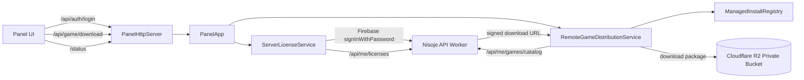

# Technical Design

## Summary

La primera distribucion remota de juegos se apoya sobre cuatro piezas ya existentes del producto:

1. `ServerLicenseService` para autenticacion/licencias.
2. `PanelApp` y `PanelHttpServer` como superficie local del host.
3. `gamesdk::GameCatalog` como contrato de catalogo ya visible en UI.
4. El formato de paquete `.zip` limpio ya generado por `package_panel_game.ps1`.

La implementacion nueva no debe reemplazar el flujo local actual. Debe agregar una segunda fuente de juegos para catalogo remoto e instalaciones administradas.

## Current Integration Points

- El catalogo de juegos se arma hoy en `src/platform/panel_app.cpp`.
- La interfaz del catalogo ya existe en `src/platform/game_catalog_source.hpp`.
- La UI ya renderiza el estado `Descargar` en `src/platform/ui/app.js`.
- El servidor HTTP local ya expone autenticacion y acciones de juego en `src/platform/panel_http_server.cpp`.
- La autenticacion remota ya consulta Firebase y el backend Nisoje en `src/platform/server_license_service.cpp`.

## Proposed Architecture



## Backend Contract

### Authentication hardening

El estado actual autentica en Firebase, pero consulta licencias solo con `firebase_uid`. Para distribucion remota, el host debe conservar:

- `firebase_uid`
- `idToken`
- email resuelto
- licencia activa seleccionada

El Worker debe recibir `Authorization: Bearer <idToken>` y validar ese token antes de devolver catalogo o URLs firmadas.

### Worker.js exact endpoint plan

El archivo actual `worker.js` ya contiene `GET /api/me/licenses`, pero en su forma actual depende solo de `firebase_uid` por query string. La migracion propuesta conserva compatibilidad temporal, pero mueve el flujo productivo a encabezados autenticados.

#### 1. `GET /api/me/licenses`

Request:

```http
GET /api/me/licenses
Authorization: Bearer <firebase_id_token>
```

Fallback temporal durante migracion:

```http
GET /api/me/licenses?firebase_uid=<uid>
```

Behavior:

- if `Authorization` exists, the Worker validates the Firebase token and resolves the user from token claims
- if only `firebase_uid` exists, the Worker can keep servicing the current panel flow during migration
- the Worker returns only active and non-expired licenses for panel access checks
- once the panel ships with token support, the fallback path should be marked deprecated

Response:

```json
{
  "valid": true,
  "user": {
    "id": 12,
    "firebase_uid": "uid_123",
    "email": "user@example.com",
    "name": "Nisoje User",
    "role": "customer"
  },
  "devices_used": 1,
  "licenses": [
    {
      "id": 33,
      "license_key": "ABC-123",
      "status": "active",
      "devices_limit": 2,
      "expires_at": null
    }
  ]
}
```

### New licensed catalog endpoint

Proposed endpoint:

```text
GET /api/me/games/catalog
Authorization: Bearer <firebase_id_token>
```

This route no longer accepts `firebase_uid` fallback. It requires a valid Firebase `idToken`.

Response shape:

```json
{
  "ok": true,
  "generated_at": "2026-04-11T03:30:00Z",
  "games": [
    {
      "game_id": "arena_live",
      "display_name": "Arena Live",
      "version": "20260411-030455",
      "source": "remote",
      "sha256": "4F32C538B3559E58AC1E231B2F5B6AA6149DE5423692A2B9A976B30B5BBCD92A",
      "download_url": "https://signed.example/...",
      "download_url_expires_at": "2026-04-11T03:35:00Z",
      "package_path": "games/arena_live/20260411-030455/arena_live-20260411-030455.zip",
      "manifest": {
        "displayName": "Arena Live",
        "description": "Juego live",
        "capabilities": []
      }
    }
  ]
}
```

`latest.json` en R2 puede actuar como origen de verdad para el Worker o como artefacto generado desde el backend. El panel no debe leer `latest.json` directamente desde el bucket.

#### 2. `GET /api/me/games/catalog`

Request:

```http
GET /api/me/games/catalog
Authorization: Bearer <firebase_id_token>
```

Worker responsibilities:

- validate Firebase token
- resolve user by `firebase_uid`
- load active licenses for the user
- load `catalog/latest.json` from R2
- filter games according to license rules
- generate short-lived signed download URLs for allowed games
- bind each signed download to the same authenticated Firebase user

Response:

```json
{
  "ok": true,
  "generated_at": "2026-04-11T03:30:00Z",
  "user": {
    "firebase_uid": "uid_123",
    "email": "user@example.com"
  },
  "games": [
    {
      "game_id": "arena_live",
      "display_name": "Arena Live",
      "version": "20260411-030455",
      "source": "remote",
      "licensed": true,
      "sha256": "4F32C538B3559E58AC1E231B2F5B6AA6149DE5423692A2B9A976B30B5BBCD92A",
      "download_url": "https://signed.example/...",
      "download_url_expires_at": "2026-04-11T03:35:00Z",
      "package_path": "catalog/games/arena_live/20260411-030455/arena_live-20260411-030455.zip",
      "manifest": {
        "displayName": "Arena Live",
        "description": "Juego live",
        "capabilities": []
      }
    }
  ]
}
```

The signed URL is not enough by itself. The download route also requires:

```http
GET /api/me/games/download?...signed params...
Authorization: Bearer <firebase_id_token>
```

The Worker validates that the bearer token belongs to the same Firebase user that received the catalog entry.

Filtering baseline:

- initial implementation can allow all active licenses to see all games
- later implementation can add a table such as `license_game_access`
- the Worker should keep the filtering code in one place so license rules can evolve without changing panel code

#### 3. Optional admin maintenance endpoint

Not required for the first panel integration, but useful for support:

```http
GET /api/admin/games/catalog
```

This endpoint can return the raw `latest.json` contents plus package paths for admin review, but it should not be a dependency of the panel runtime.

## R2 Layout

```text
games-catalog/
  catalog/
    latest.json
    games/
      arena_live/
        20260411-030455/
          arena_live-20260411-030455.zip
          arena_live-20260411-030455.sha256.txt
      conquista/
        20260411-030455/
          conquista-20260411-030455.zip
          conquista-20260411-030455.sha256.txt
```

`latest.json` proposed content:

```json
{
  "generated_at": "2026-04-11T18:15:38Z",
  "games": [
    {
      "game_id": "arena_live",
      "display_name": "Arena Live",
      "version": "20260411-030455",
      "package_path": "catalog/games/arena_live/20260411-030455/arena_live-20260411-030455.zip",
      "sha256_path": "catalog/games/arena_live/20260411-030455/arena_live-20260411-030455.sha256.txt",
      "sha256": "4F32C538B3559E58AC1E231B2F5B6AA6149DE5423692A2B9A976B30B5BBCD92A",
      "manifest": {
        "gameId": "arena_live",
        "displayName": "Arena Live",
        "version": "20260411-030455",
        "description": "Juego standalone live heredado de LivePanel v2, adaptado como modulo externo para Nisoje Studio.",
        "author": "Nisoje Studio",
        "capabilities": []
      }
    },
    {
      "game_id": "conquista",
      "display_name": "Conquista",
      "version": "20260411-030455",
      "package_path": "catalog/games/conquista/20260411-030455/conquista-20260411-030455.zip",
      "sha256_path": "catalog/games/conquista/20260411-030455/conquista-20260411-030455.sha256.txt",
      "sha256": "8416614144B91546396A7693242012B93A637CDE4BB912D41422C5AC1628152A",
      "manifest": {
        "gameId": "conquista",
        "displayName": "Conquista",
        "version": "20260411-030455",
        "description": "Juego standalone 3:4 de conquista territorial heredado de LivePanel v2, adaptado como modulo externo para Nisoje Studio.",
        "author": "Nisoje Studio",
        "capabilities": []
      }
    }
  ]
}
```

## Host-side Components

### 1. `RemoteGameDistributionService`

New platform service owned by `PanelApp`.

Responsibilities:

- fetch remote licensed catalog from the Worker
- keep download/install state for the UI
- download package files to a managed local cache
- verify SHA-256
- extract packages into managed install directories
- refresh install registry and merged game catalog

### 2. `ManagedInstallRegistry`

Small JSON registry persisted under the current user profile, for example:

```text
%LOCALAPPDATA%\NisojeStudio\
  downloads\
  games\
    arena_live\
      20260411-030455\
    conquista\
      20260411-030455\
  state\
    remote_game_installs.json
```

Stored fields:

- game id
- installed version
- install root
- sha256
- install timestamp
- source = `remote`

### 3. `MergedGameCatalogSource`

The host should keep local discovery and merge three sources:

1. built-in local games
2. manually discovered external local games
3. remote licensed games with local install state

Merge rules:

- installed local/manual games stay launchable immediately
- remote games not yet installed appear with `installed=false`
- remote games already installed appear with `installed=true`
- if the remote version is newer than the installed one, UI can expose update state later

## Local HTTP Surface

### New endpoints

```text
POST /api/game/download
POST /api/game/install-status
```

Minimal request:

```json
{
  "gameId": "arena_live"
}
```

Minimal install status response:

```json
{
  "ok": true,
  "downloads": [
    {
      "gameId": "arena_live",
      "state": "downloading",
      "progress": 42,
      "message": "Descargando paquete"
    }
  ]
}
```

`/status` should also expose remote catalog and current install operations so the UI can refresh without a second polling system.

## Installation Workflow

1. User authenticates in the panel.
2. `ServerLicenseService` stores `firebase_uid`, `idToken`, active license and auth state.
3. `RemoteGameDistributionService` calls `/api/me/games/catalog`.
4. The panel merges the remote catalog into the current game list.
5. User clicks `Descargar`.
6. Host downloads the ZIP to `%LOCALAPPDATA%\NisojeStudio\downloads`.
7. Host verifies SHA-256 before extraction.
8. Host extracts to `%LOCALAPPDATA%\NisojeStudio\games\<gameId>\<version>`.
9. Host validates `module_manifest.json` and resolved entry executable using the existing external game manifest pipeline.
10. Host records the installation in `remote_game_installs.json`.
11. Host refreshes the catalog and the UI now shows the game as installed.

## Extraction Strategy

To avoid a new ZIP dependency in C++, the first implementation should reuse Windows PowerShell `Expand-Archive` through a small helper script invoked by the host.

Why this choice:

- Windows 10/11 already include PowerShell 5.1.
- The repo already uses `Expand-Archive` in packaging scripts.
- It keeps the first implementation smaller and reversible.

Future replacement is possible if a native ZIP layer becomes necessary.

## UI Changes

The current `download` button in `src/platform/ui/app.js` should stop logging a placeholder and instead:

- call `POST /api/game/download`
- render transient states such as `Descargando`, `Verificando`, `Instalando`, `Error`
- keep existing `Activo` and `Iniciar juego` states unchanged

## Validation Strategy

### Host validation

- unit tests for remote catalog JSON parsing
- unit tests for install registry read/write
- unit tests for merge logic between local and remote catalog entries

### Integration validation

- mock Worker response with one licensed game and one unlicensed game
- download/install smoke using a local HTTP-served ZIP fixture
- manifest validation against the existing external game audit pipeline

### Manual validation

- login with a valid account
- see remote catalog items in the UI
- download `Arena Live`
- verify install under `%LOCALAPPDATA%\NisojeStudio\games`
- launch the installed game from the panel

## Risks

1. WebView games still expose shipped HTML/JS after installation; this design reduces exposure but does not make client code secret.
2. Signed URL expiry must allow slow downloads without being too permissive.
3. The current auth flow must retain Firebase `idToken`; otherwise the backend authorization model stays weak.
4. PowerShell extraction is acceptable for Windows-first delivery, but a future cross-platform host would need a different unzip path.
5. The current `worker.js` contains duplicated `/api/admin/license-by-key` blocks; the Worker should be cleaned before adding more endpoints so production behavior stays deterministic.
